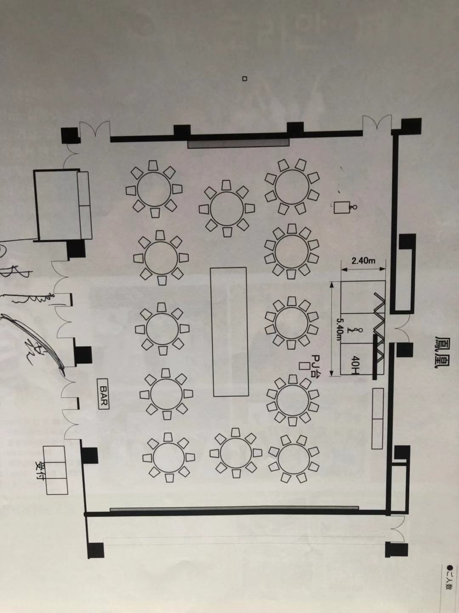
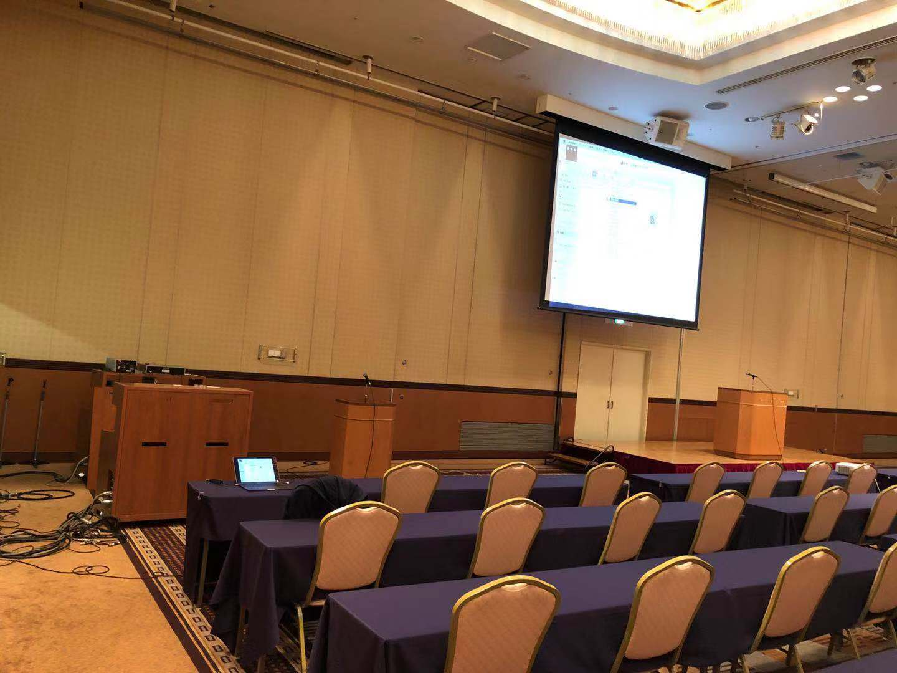

# 랑그웃도 호텔(HOTEL Lungwood)의 음향시설에 관한 메모 

> 본 메모는 일본 조선족들이 자주 사용하는 닛뽀리 랑그웃도 
> 호텔(https://www.hotellungwood.com/)의 음향 시스템 
> 상황을 정리한 것입니다. 금후 혹시 상기 호텔에서 송년회나 파티를 
> 진행하시는 분들에게 조금이라도 참고가 되었으면 합니다. 

> 아래 내용은 2018년 11월 8일(목) 주말 (11월11일 일요일) 있게될 
> 재일조선족여성회 샘물한글학교 발표회 및 창립 10주년 기념행사를 위해
> 음악효과 및 프로잭타 설비를 테스트하면서 기록한 것입니다. 

### 테스트 내용 및 기본 컨셉 

* 빔프로와 컴퓨터의 분리 
* 빔프로는 회의장 복판 무대 앞쪽으로 배치 
* 컴퓨터는 회의장 변두리에서 조작 

### 이번에 빌린 회의장의 특점 

참가자가 100명을 넘기에 회의장 두개를 합병시켜 크다란 회의장 하나로 
만드는 식으로 되어 있음. 무대는 복판에 있고, 량옆에 빔프로 화면이 있는데 
그중 왼쪽은 자동승강막, 우쪽은 수동승강막, 이번에는 그냥 일부 절목에서만 
빔프로 사용하기에 자동승강막이 있는 왼쪽 스크린을 쓰기로 했음. 

### 컴퓨터 위치와 빔프로의 위치 

간단히 설명하자면: 컴퓨터를 연결하는 선은 왼쪽에 있고, 빔프로는 복판에 놓여있음. 

연장선 타이프: HDMI선 (길이는 충분히 됨, 호텔에서 제공, 빔프로 in HDMI, 컴퓨터 out HDMI)

음향연결 타이프: 3.5mm 연결단자 (컴퓨터 out 3.5mm )

컴퓨터의 설정: 음향을 외부설비가 아닌 컴퓨터로 설정 (MacBook)

### 주의사항 !

회장내부에서 인터넷 연결이 되지 않기에 (실제 테스트 해 본 결과 핸드폰으로 
연결하더라도 신호가 좋지 않아 유튜브연결이 안되었음 ) 꼭 컴퓨터에 파일로 
저장해서 사용할 필요가 있음. 

공간이 크기에 같은 음악이라도 음질에 따라 효과가 현저하게 차이남. 될 수 있으면 
좋은 음질로 준비하는게 좋음. 

### 간편한 사용방법에 대한 제안 

* 음악만 띄울 경우에는 핸드폰으로 저장하여 연결하여 띄워도 됨 !

* 동영상도 hdmi 전환기계만 있으면 핸드폰으로 띄울 수 있음 ! 

* 파워포인트는 테스트해보지 않았지만 충분히 될거라고 생각됨 

