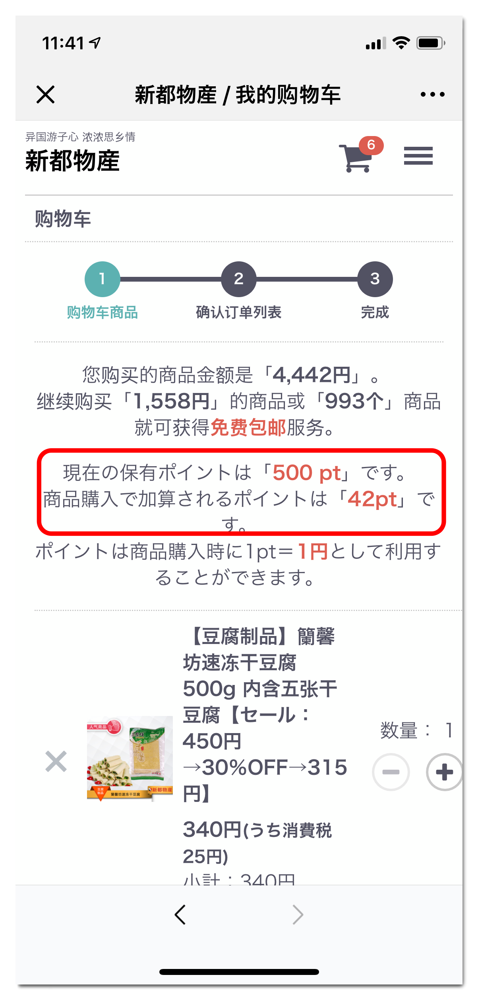
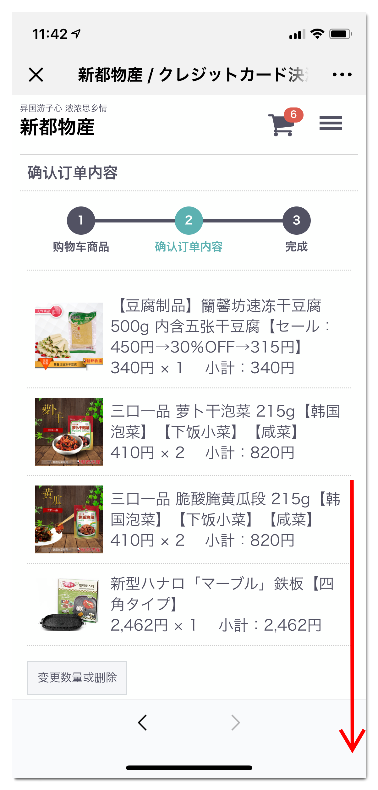
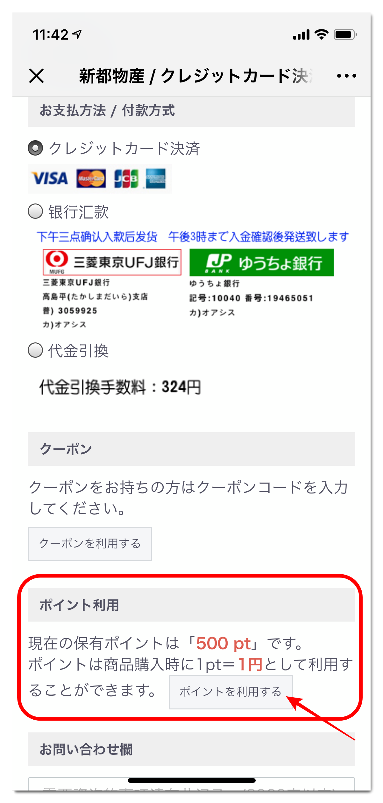
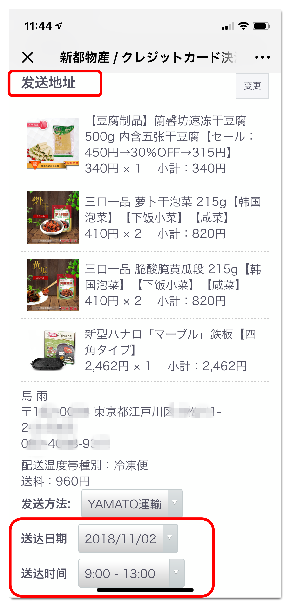
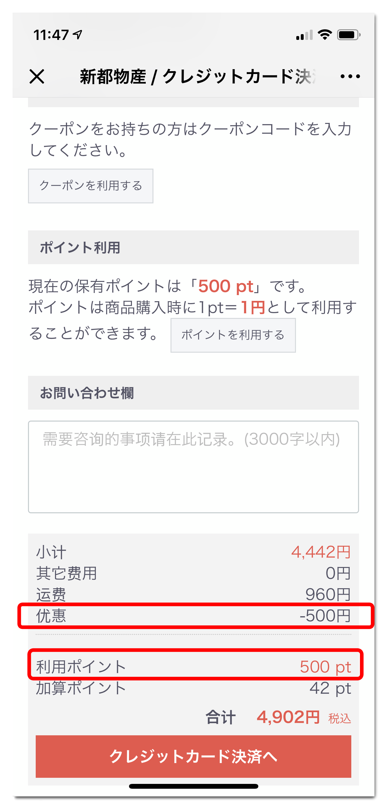
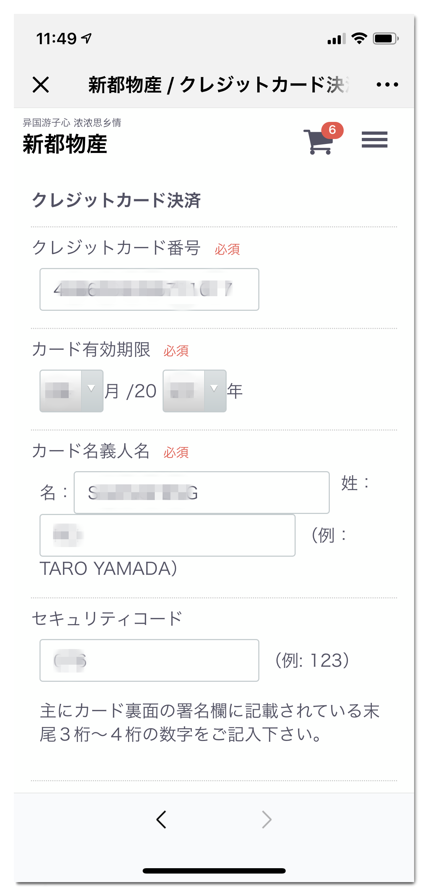
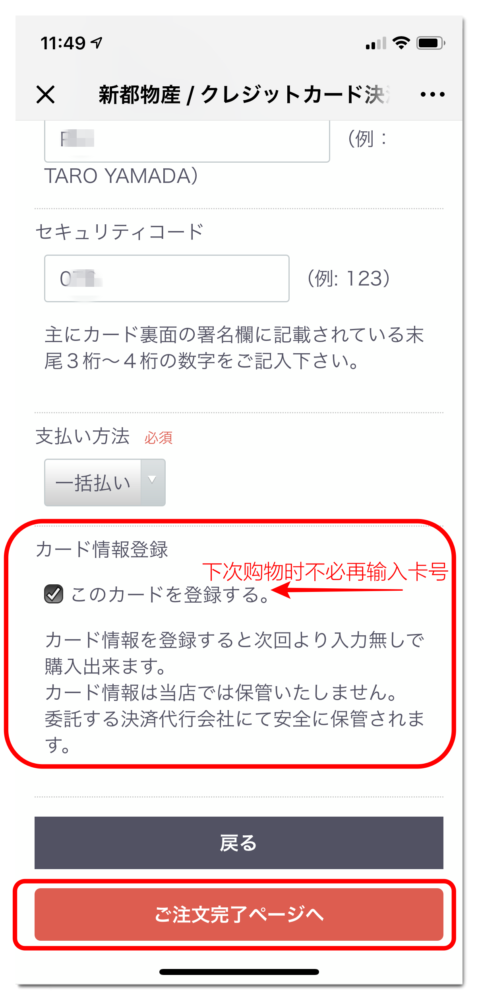
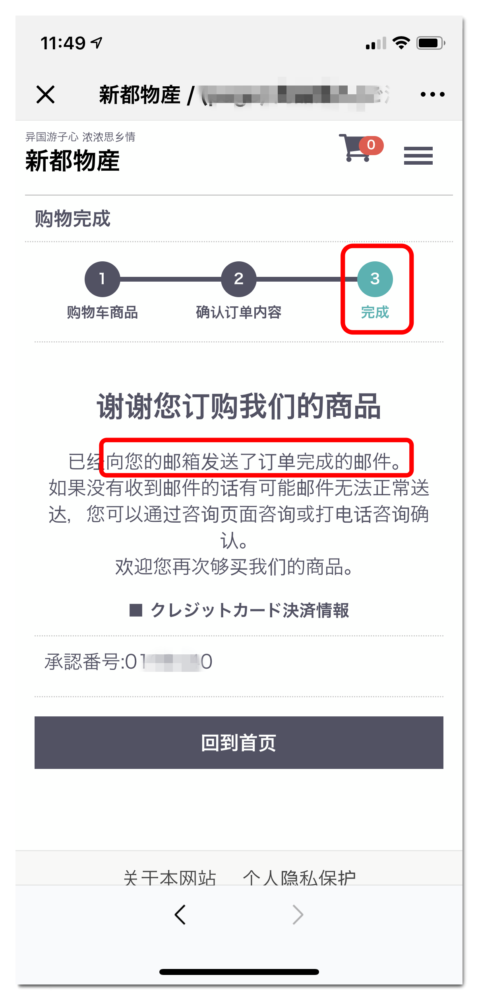
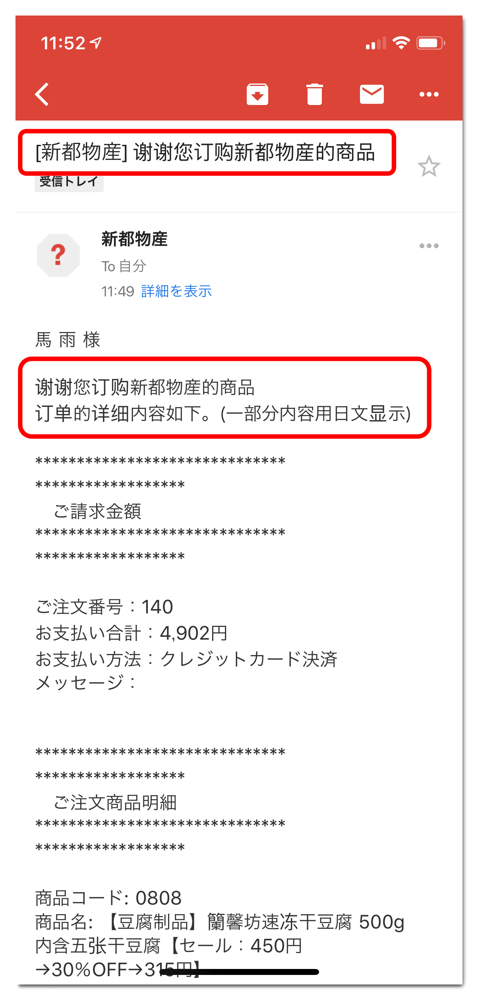

# 如何使用point 

> 在新都物产每次购买食品都会有1%point的积累

> 而且在某些活动期间加入会员就会有500个point的赠送

> 这些point与日元是1:1的关系，1 point = 1 日元，可以立即使用 

### 在购买商品后结账时如下操作

购买只需三个步骤

1. 确认购物车内容

2. 确认付款方式及快递时间（是否使用point就在这指定）

3. 完成（系统会自动发送通知邮件）

那我们看一下具体如何设定。 

#### 第一步 确认购物车内容 

> 确认购物车商品时能看到可以使用的point 

#### 第二步 指定要使用的point数

> 画面往下拉会看到付款方式下面有关于point的操作领域

> 点击"ポイントを利用する"后进入设置要使用的point点数后按确认回到结账画面。 

> 当然，不要忘了指定送达日期哦~ 如果没有指定的话会默认用最快的日期发货。 

> 在结账按钮之前会看到point的使用情况。 在总费用中已经扣除了point。 

> 这是指定信用卡的例子， 如果在"このカードを登録する" 上划勾的话，
> 下次购买时就不必要再输入卡号信息了，免去了每次输入的繁杂。 

#### 第三步 购物完成

> 完成画面如上

> 同时还会有邮件发送到会员邮箱里。 

到此愉快的购物完成。敬请等待商品送到家里。 