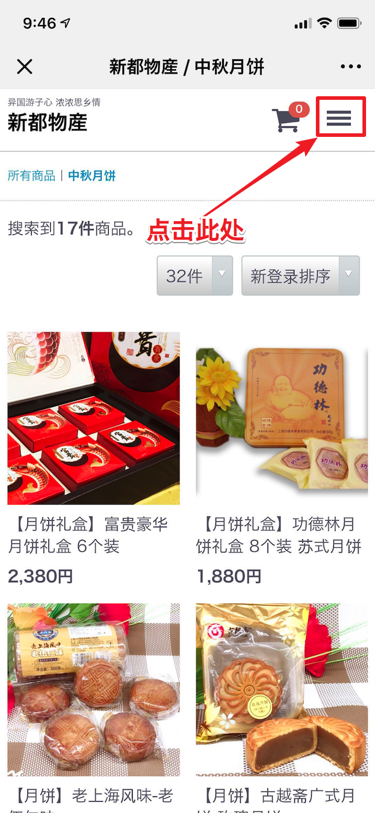
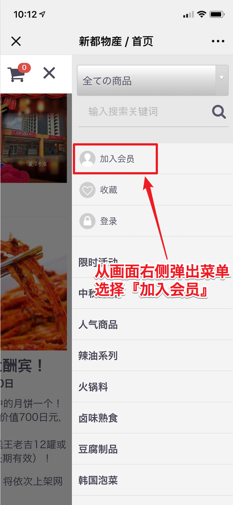
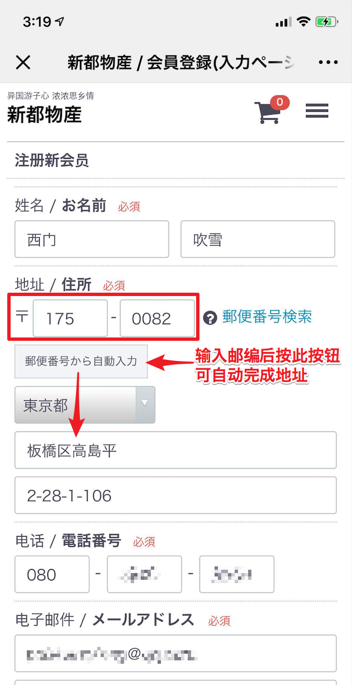
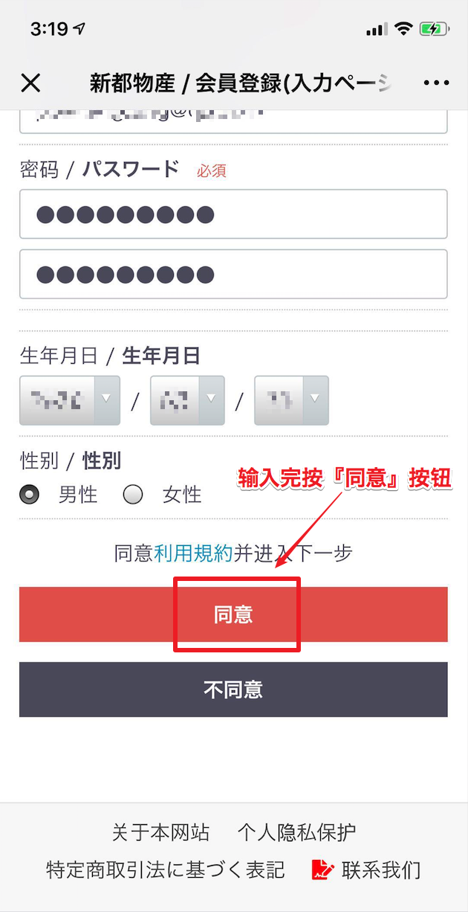
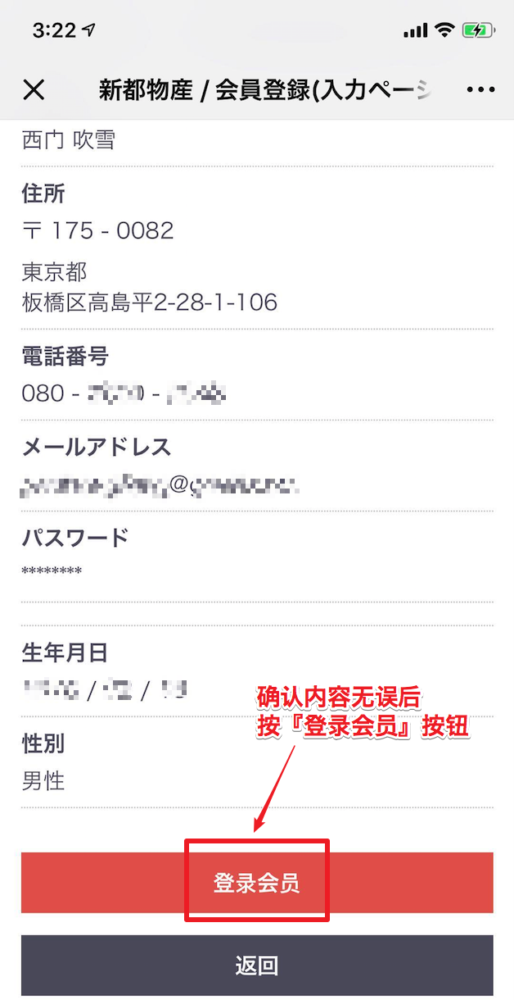
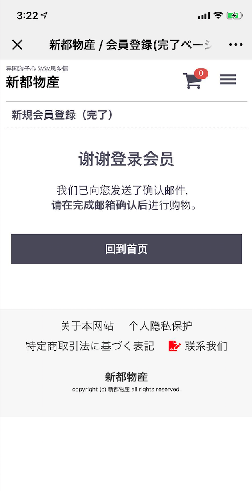
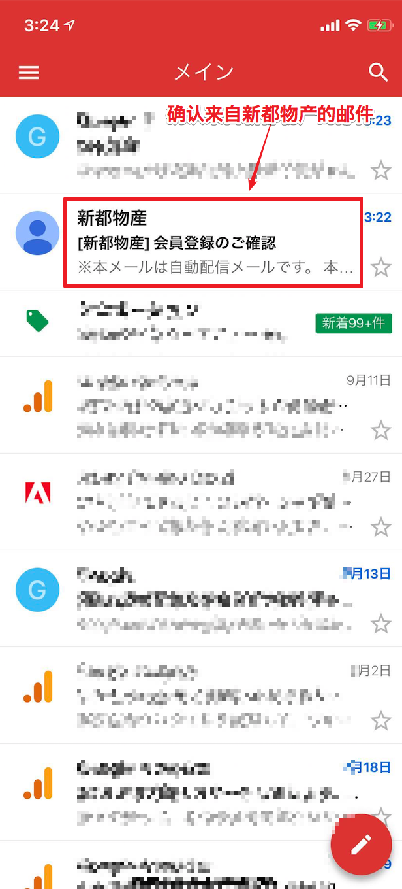
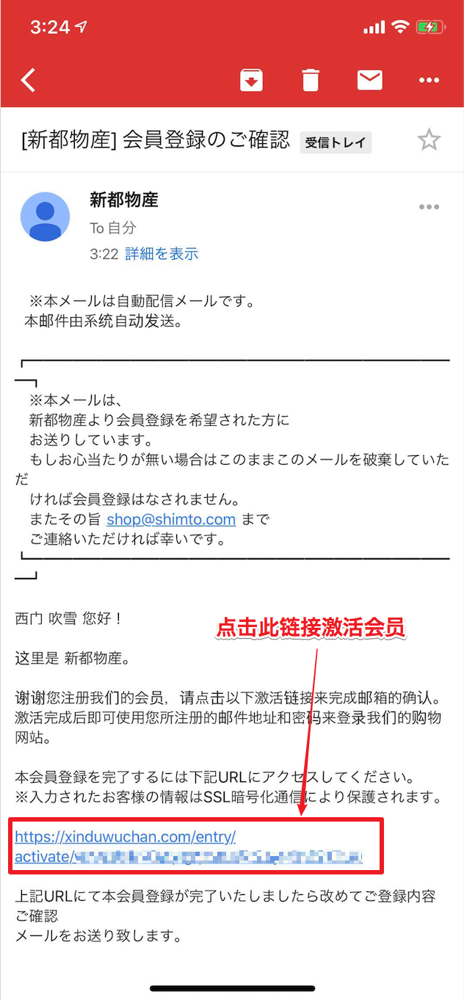
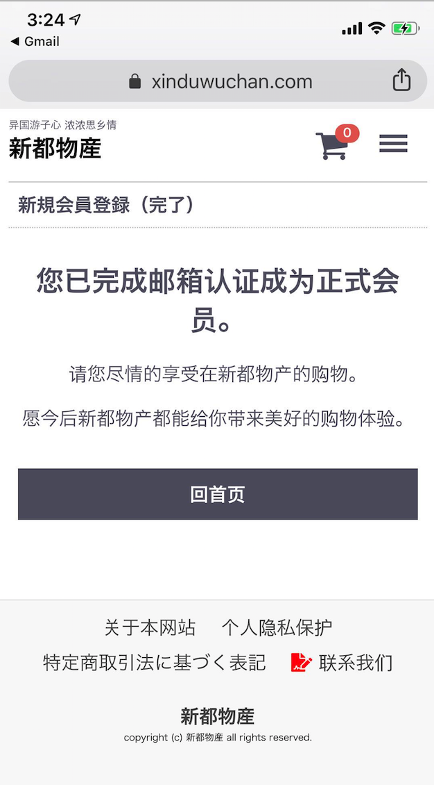

# 如何加入会员

> 加入会员非常简单，只需提供几项必需内容及进行邮箱确认激活便可。 

> 下面假设在iphone手机上的微信界面上打开新都物产网站后的操作实例做为说明。 

#### 第一步 找到并打开『加入会员』界面

在画面的右上角可以看到『三』字形的按钮，点击。

从画面的右侧会弹出菜单，并占据大概一半左右的画面。弹出来的菜单上第一项便是『加入会员』，点击。 

#### 第二步 输入会员信息

所需输入的信息不多。

必需项目有：姓名，地址，电话，邮箱，本网站的登录密码

而选项（可以不输入）有：生日，性别 

输入地址时先把邮编输入进去，再按『郵便番号から自動入力』(根据邮编自动完成)按钮则会自动完成地址的输入。

写完所有信息后，按『同意』按钮。 

如果输入没有错误（如果输入的内容有错误时画面不会迁移，并显示错误内容，可根据提示进行修改后再次提交），就会显示确认信息画面，如下图。 

确认所输入的内容无误后，按『登录会员』按钮。 

注意！还有最后一步！一定要到自己的邮箱确认激活才可使用！

#### 第三步 最后一步 确认邮箱并激活

打开邮件App（在本例中用的是Gmail）, 找到来自新都物产的邮件。（如果在邮件列表里找不到，请尝试去垃圾箱去看看有没有误分类到垃圾邮件中），找到后点击。 

邮件中有一段简短的说明，并在下方付有链接地址，点击。 

画面会跳转，邮箱App会打开第三方浏览器（在本例中是Google Chrome）, 如果看到如下信息便完成注册。 

尽情享受购物吧。 

下次登录时，点击菜单上的『登录』按钮，以登记的邮箱做ID， 以之前输入的网站密码做为密码登录即可。 

