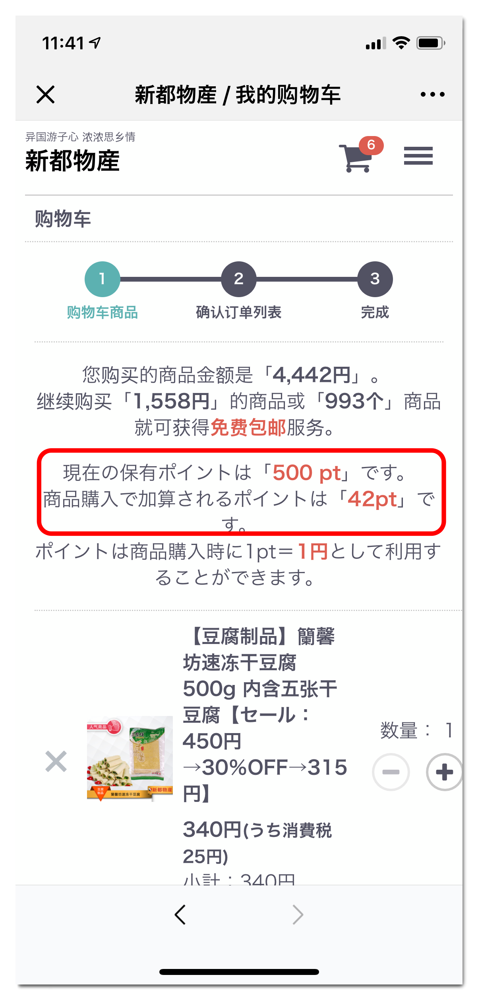
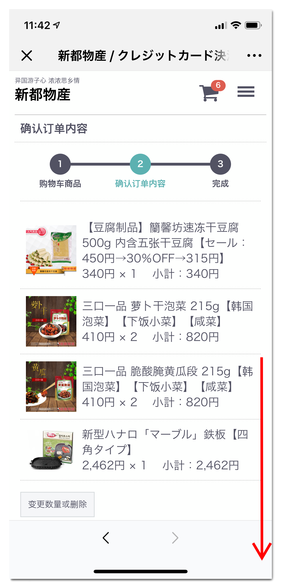
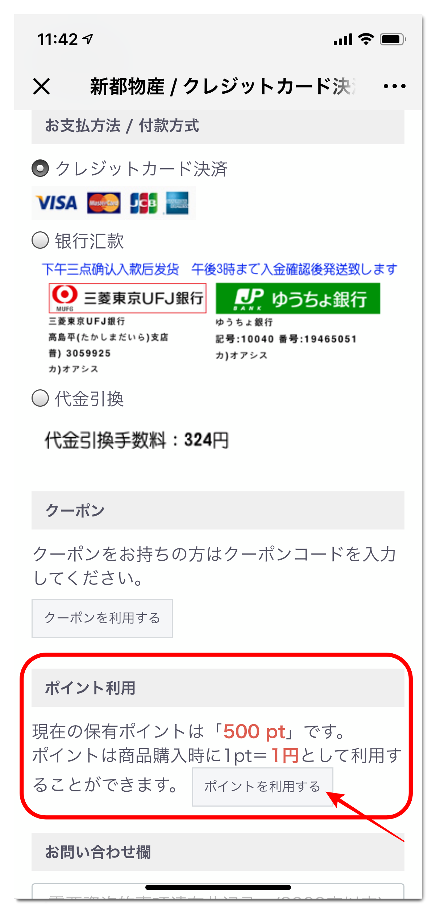
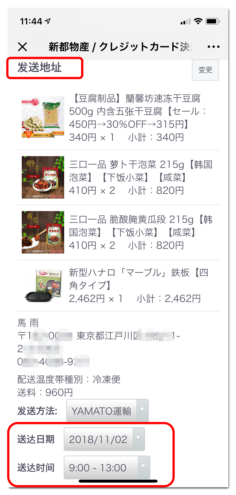
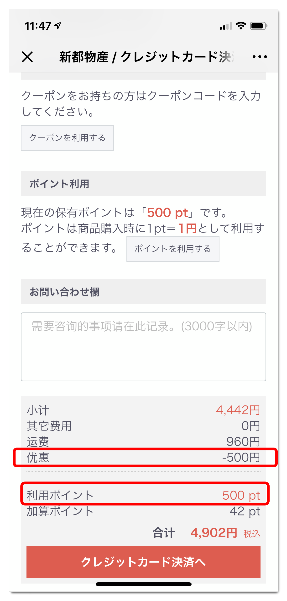
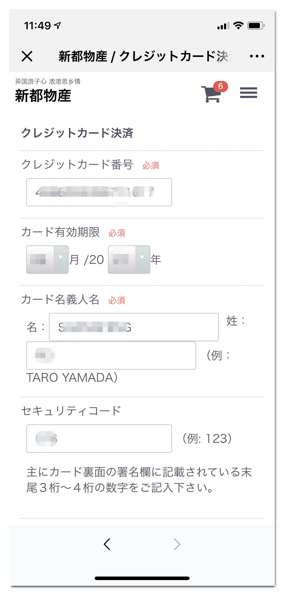
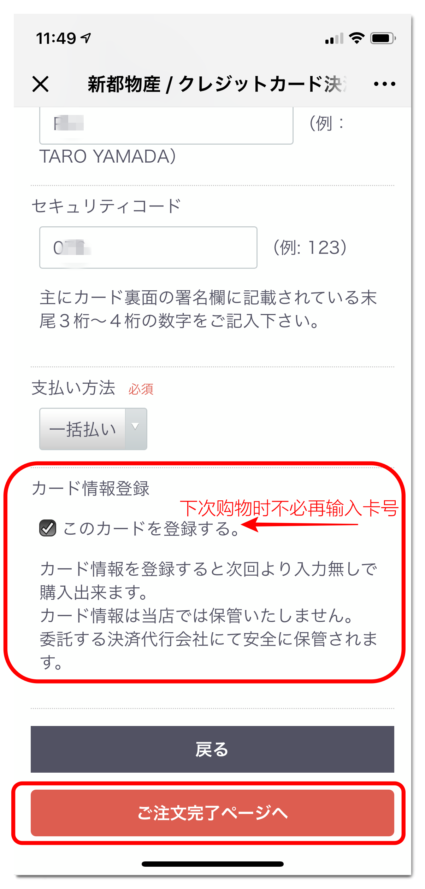
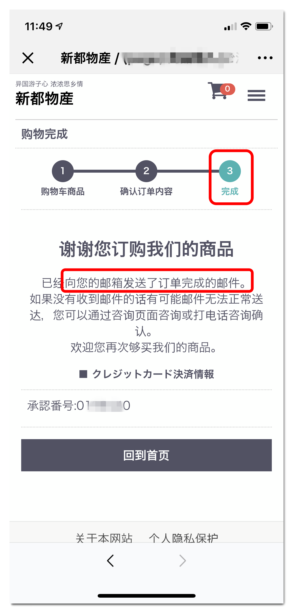
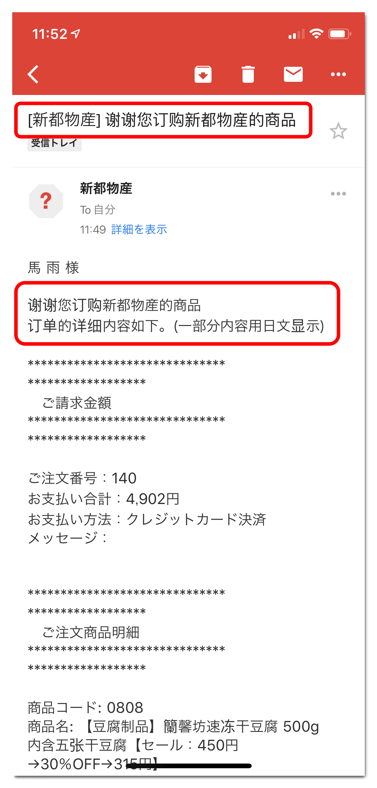

# 如何重设密码 

> 从쉼터물산自动迁移过来的用户，开始的密码是不可见的。

> 可以用如下方式重新生成临时密码发磅到本人的邮箱，

> 然后用临时密码登陆后再重新设置密码。

#### 如何知道自己的邮箱有没有迁移

#### 第一步 确认购物车内容 

> 确认购物车商品时能看到可以使用的point 

#### 第二步 指定要使用的point数

> 画面往下拉会看到付款方式下面有关于point的操作领域

> 点击"ポイントを利用する"后进入设置要使用的point点数后按确认回到结账画面。 

> 当然，不要忘了指定送达日期哦~ 如果没有指定的话会默认用最快的日期发货。 

> 在结账按钮之前会看到point的使用情况。 在总费用中已经扣除了point。 

> 这是指定信用卡的例子， 如果在"このカードを登録する" 上划勾的话，
> 下次购买时就不必要再输入卡号信息了，免去了每次输入的繁杂。 

#### 第三步 购物完成

> 完成画面如上

> 同时还会有邮件发送到会员邮箱里。 

到此愉快的购物完成。敬请等待商品送到家里。 